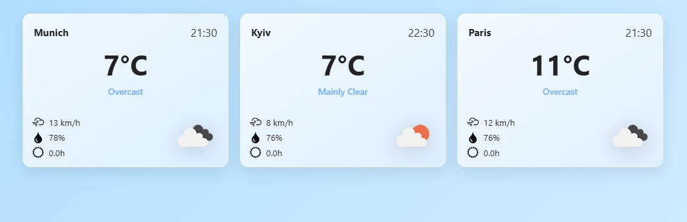
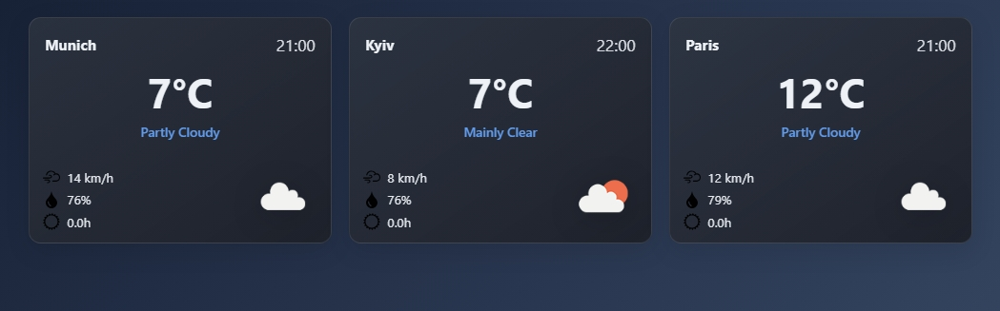

# 🌦️ WEATHER-APP

Приложение **Weather App** — это минималистичный и современный виджет погоды, который автоматически подгружает актуальные данные с сервиса [Open-Meteo API](https://open-meteo.com/) и отображает их в виде карточек для выбранных городов.  💡 В текущей версии отображаются три города: **Мюнхен**, **Киев** и **Париж**.

---
## 📸 Пример интерфейса

<p align="center">
  
  
</p>

<p align="center">
  🌤️ Светлая и тёмная тема автоматически меняются в зависимости от времени суток.
</p>

---
## 🧰 Используемые технологии

* **TypeScript** `v5.8.3`
* **Vite** `v7.1.2`
* **CSS**
* **ESLint** `v9.38.0`
* **TypeScript-ESLint** `v8.46.2`
* **Jiti** `v2.6.1`
* **Prettier** `v3.6.2`

---

## ⚙️ Установка и запуск


### 1️⃣ Клонируем репозиторий
```bash
  git clone https://github.com/OksanaOtroshevska/weather-app.git
```

### 2️⃣ Устанавливаем зависимости

```
  npm install
```

### 3️⃣ Запускаем проект

```
  npm run dev 
```
*После запуска сервер откроется по адресу, который выведется в терминале (например: http://localhost:5173).*


### 4️⃣ Сборка проекта (компиляция)

```
  npm run build
```

*Проект будет скомпиллирован в папку* `dist/`

### 5️⃣ Предварительный просмотр

```
  npm run preview
```

---
## 📂 Основные файлы и логика


  **Главный файл:** `main.ts`

*Здесь находится весь код приложения.*

### 🔧 Основные функции:

  * `fetchWeather(city)` — загружает погоду по координатам города с API.
  * `buildParams(city)` — формирует параметры запроса.
  * `buildCard(city, data)` — создаёт HTML-карточку с погодой.
  * `buildErrorCard(city, err)` — отображает сообщение об ошибке.
  * `updateWeather()` — основная функция, обновляющая интерфейс каждые 60 секунд.

  *Карточки строятся динамически с помощью DOM-методов и автоматически подстраиваются под время суток (день/ночь).*

  ## ☀️🌙 Смена темы (день / ночь)

  В `buildCard` определяется локальное время из API.
  Если время между 6:00 и 20:00 — применяется класс `.day`, иначе `.night.`
  В CSS для этих тем задаются разные фоны и цвета текста.

  ## 🌤️ Иконки погоды

  Используются иконки с [OpenWeatherMap](https://openweathermap.org/weather-conditions), подбираемые по `weather_code` из API.

---
## 💡 Автор
  Проект создан в учебных целях.
  
  Используется современный стек: **TypeScript** + **Vite** + **Fetch API** + **Open-Meteo API**.


